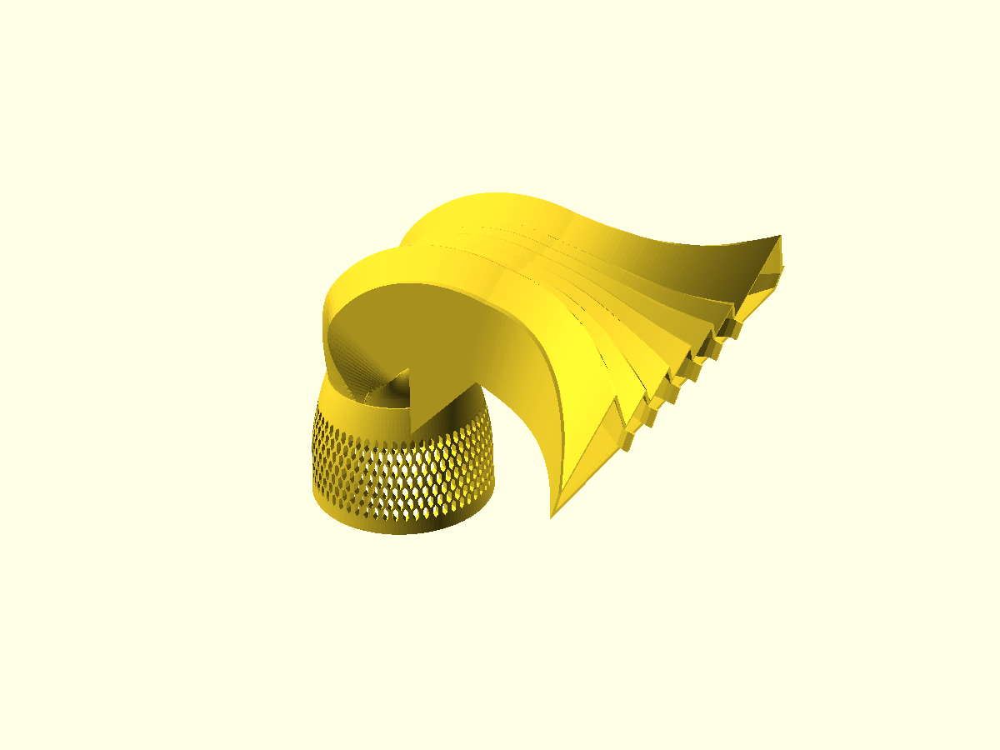

# MP60 low-profile 90° fan shroud (bottom-mounted VorTech)

A drop-in replacement for the EcoTech VorTech **MP60 wet-side cage** for
**through-the-bottom mounting** in a peninsula reef tank. Single 3D-printed
part: the stock bayonet mount and perforated intake barrel, plus a swept 90°
elbow that turns the vertical discharge into a wide, floor-angled ~90°-arc
sheet of flow aimed down the tank — a hideable gyre substitute for the open
end of a peninsula.

Total height **179 mm off the glass** (parametric). Geometry chosen by CFD:
a local optimization loop (lattice-Boltzmann sims + an LLM proposer) ran
dozens of 2D flow simulations, including full 1.8 m tank-scale runs with
rockwork, to pick every dimension. Details below.



## Design highlights (what the sims taught us)

| finding | detail |
|---|---|
| swept vaneless elbow | K ≈ 0.19 — turning vanes made it *worse* (0.61), mitered/louvered corners much worse (1.3–2.4). At this scale vane friction+wakes beat separation savings. |
| pump keeps ~97% flow | propeller-stall derating model: 5.35 of 5.52 L/s at 70% drive |
| fan needs vanes | without cambered splitter vanes the widening fan tunnels straight (spread σ20 mm); with 6 vanes it fills the full arc (σ57 mm) |
| 15° floor tilt | sweeps detritus off the bare bottom; 25° drives the sheet into the rockwork and dies |
| launch height rule | **the exit must clear the rock directly in front of it by 20–40 mm** — a below-crest exit dead-ends in a trapped vortex no matter the duct shape. This build: exit at 118 mm → keep foreground rock under ~93 mm |
| gothic-ridge roof | chevron cross-sections keep every interior surface ≥45°: single print, rim-down, supports only under the fan floor (build-plate) |

Tank-scale result vs a below-crest exit: coral-zone coverage 0 → 4.8%,
rock wrap-over 2.2×, dead zones behind rocks 100% → 73%.

## Files

- `mp60_shroud_v3.stl` — generated locally (402 cm³; 226×256×175 mm print), see below
- `build_v3.py` — fully parametric generator (numpy lofts + manifold
  booleans). Key knobs at top: `MAX_TOTAL_H_GLASS` (height cap, default
  180), `WETSIDE_H`, wall, vanes. Reads `agent/final.json`.
- `cfd/lbm.py` — D2Q9 lattice-Boltzmann + Smagorinsky LES solver:
  elbow slice, fan plan, and closed-tank (with rocks, free surface,
  actuator jet) planes. Mass-balance-validated.
- `agent/` — the local optimization loop: qwen3:14b (Ollama) proposes
  candidates, this machine runs 8 parallel sims/round, tank sims decide
  finals. `agent/log.md` is the full campaign narrative.
- `cage.stl` — the stock cage mesh the part is built on (see attribution)
- v1 (`mp60_fan_shroud.scad`, clamshell) and v2 (`build_v2.py`, mitered)
  kept for reference; superseded.

## Fidelity caveats

2D LES slices at reduced Reynolds number: excellent for *ranking*
geometries and flow topology (every decision here), indicative-only for
absolute velocities. The tank plane is a 2D vertical slice — real 3D
spread will be gentler. Not yet wet-tested; sim-driven design.

## Print & install

Black PETG (carbon black = UV stabiliser), 0.2 mm layers, 4+ perimeters,
40% infill. Supports on build plate only (under the fan floor). Rinse,
soak 24 h in saltwater, bayonet onto the wet side like the stock cage,
clock the fan down-tank before locking (lugs quantize to 120° — fine-aim
with the pump body). Bottom-mount basics: correct spacer for your glass,
catch bracket under the dry side, run 30–40% for the first week and
listen to the bushing.

## Getting the STL (license-respecting build)

The intake cage geometry is ["Ecotech MP60 Cover" by asadler99 on
Cults3D](https://cults3d.com/en/3d-model/home/ecotech-mp60-cover), free
under the **Cults Private Use license** — which permits printing for
yourself but not redistribution of the mesh or derivatives. So this repo
does **not** contain `cage.stl` or the final shroud STLs; it contains
everything needed to build them locally in under a minute:

```bash
pip install numpy trimesh manifold3d scipy networkx
# download the free 3MF from the Cults link above, then:
python3 extract_cage.py ~/Downloads/EcotechV60Modified.3mf
python3 build_v3.py            # -> mp60_shroud_v3.stl
```

## Attribution & license

- Cage mesh: (c) [asadler99](https://cults3d.com/en/users/asadler99),
  [Cults PU license](https://cults3d.com/en/licenses#cults_pu) — print for
  private use only; not redistributed here. Thanks for a cleanly-modeled
  base part. (Permission to include the derived STLs has been requested
  from the author, July 2026 — if granted, prebuilt STLs will be added.) VorTech and MP60 are EcoTech Marine trademarks; this is an
  unaffiliated hobby project — use at your own risk.
- Code (generator, extractor, CFD solver, optimizer): MIT.
